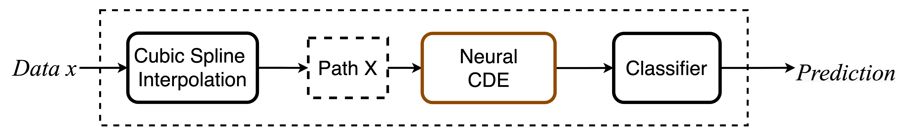
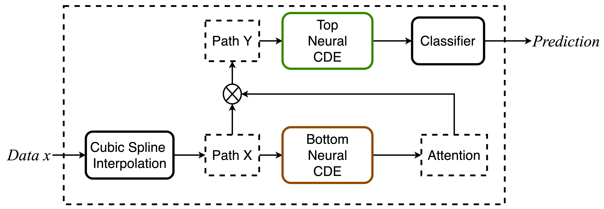
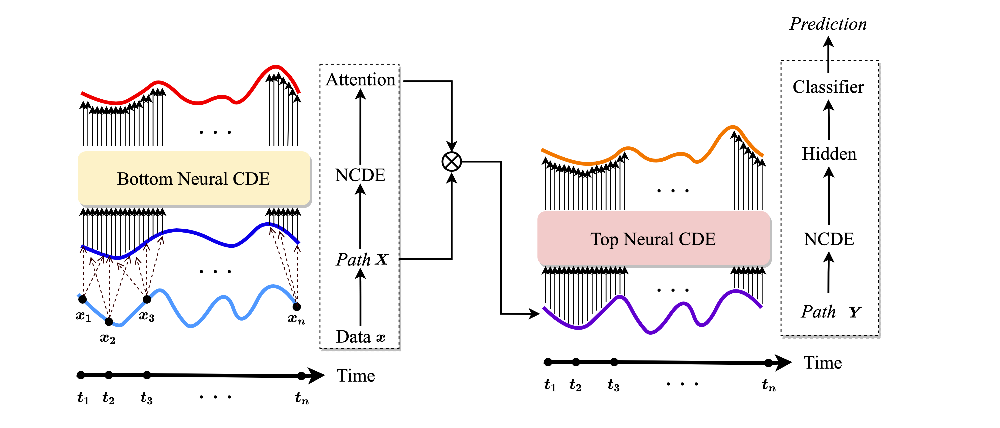
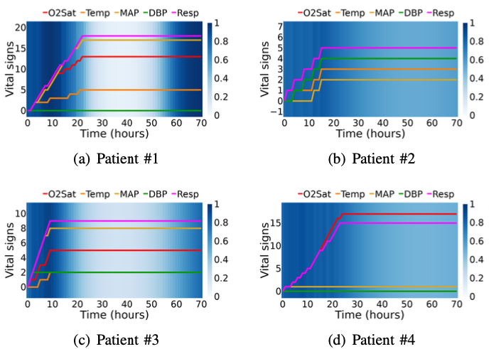

<h1 align='center'> Attentive Neural Controlled Differential Equations for Time-series Classification and Forecasting<br>
    for Time-Series Classification and Forecasting<br>
    [<a href="https://arxiv.org/abs/2109.01876">arXiv</a>] </h1>

<p align="center">
  
   
  The overall architecture of NCDE
</p>

<p align="center">
   
  Our proposed attentive NCDE In our method, the bottom NCDE produces attention values and the top NCDE produces the last hidden vector. 
  
</p>
<p align="center">
   
  The detailed architecture of our proposed attentive NCDE. From the raw time-series data x(t), the continuous path X(t) is created by the natural cubic spline algorithm. The bottom NCDE reads X(t) to produce attention values. The path Y(t) is defined as the (element-wise) multiplication of X(t) and the attention value at time t. The top NCDE produces the last hidden vector with Y(t). Our framework supports both classification and regression.
</p>
<p align="center">
   
  
</p>
<p>The soft attention visualization in physioNet Sepsis. Blue means strong attention and white means weak attention. Note that the bottom NCDE gives strong attention when there are non-trivial changes on the curves.</p>

<p align="center">
   
  
</p>

  <p>The soft attention visualization in Google Stock. Blue means strong attention and white means weak attention. Note that the open price has weak attention always. This is because it shows high correlations to other values. Our attention model strategically ignores the open price.</p>

### create conda environments
```
conda env create --file ancde.yml
```

### activate conda 
```
conda activate ancde
```

### UEA_CharacterTrajectories
```
python3 uea_attentive.py --seed 2021 --missing_rate 0.3 --model="ancde" --h_channel 40 --hh_channel 40 --layer 3 --lr 0.001 --soft 'True' --slope_check '' --timewise 'True' --attention_channel 20 --attention_attention_channel 10 --step_mode 'valloss'
```

### PhysioNet Sepsis No OI
```
python3 sepsis_attentive.py --seed 2021 --intensity '' --model="ancde" --h_channel 49 --hh_channel 49 --layer 4 --lr 0.00001  --soft 'True' --slope_check '' --timewise 'True' --attention_channel 20 --attention_attention_channel 20 --step_mode 'valloss'
```

### PhysioNet Sepsis OI
```
python3 sepsis_attentive.py --seed 2021 --intensity 'True' --model="ancde" --h_channel 49 --hh_channel 49 --layer 4 --lr 0.00001  --soft 'True' --slope_check '' --timewise 'True' --attention_channel 20 --attention_attention_channel 20 --step_mode 'valloss'
```
### Google Stock
```
python3 stock.py --seed 2021 --input_seq 20 --output_seq 5 --model="ancde_forecasting" --h_channel 12 --hh_channel 12 --layer 2 --lr 0.001 --soft '' --slope_check 'True' --timewise '' --attention_channel 4 --attention_attention_channel 8 --step_mode 'valloss'
```
### Google Stock(NCDE)
```
python3 stock.py --seed 2021 --input_seq 20 --output_seq 5 --model="ncde_forecasting" --h_channel 12 --hh_channel 12 --layer 2 --lr 0.001 --soft '' --slope_check 'True' --timewise '' --step_mode 'valloss'
```

### Mujoco 
```
python3 mujoco.py --seed 2021 --input_seq 20 --output_seq 5  --model="ancde_forecasting" --h_channel 12 --hh_channel 12 --layer 2 --lr 0.001 --soft '' --slope_check 'True' --timewise '' --attention_channel 4 --attention_attention_channel 8 --step_mode 'valloss'
```

### Run shell file (ex PhysioNet Sepsis dataset)
```
sh sepsis.sh 
```
### Run shell file, background  (ex PhysioNet Sepsis dataset)
```
nohup sh sepsis.sh 2>sepsis.err 1>sepsis.log & 
```

### Citation
```bibtex
@article{jhin2021attentive,
  title={Attentive Neural Controlled Differential Equations for Time-series Classification and Forecasting},
  author={Jhin, Sheo Yon and Shin, Heejoo and Hong, Seoyoung and Jo, Minju and Park, Solhee and Park, Noseong},
  journal={ICDM},
  year={2021}
}
```
